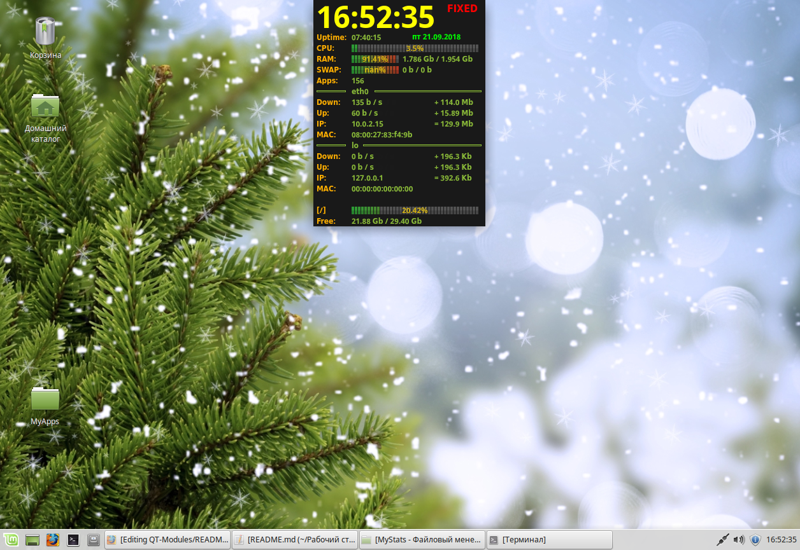

# MyStats
The application for monitoring computer resources

###The configuration file is created here ~/.config/MySoft/MyStats.conf
     Click the left mouse button on the window (set / remove) the window lock

**=== MyStats v1.0 =========**

* Bug fixes
* make on QT libs

**=== MyStats v0.3 =========**

* Bug fixes
* Added ability to logging
* The display of logging
* Logs are written every minute when updating window is set less than 1000 milliseconds

